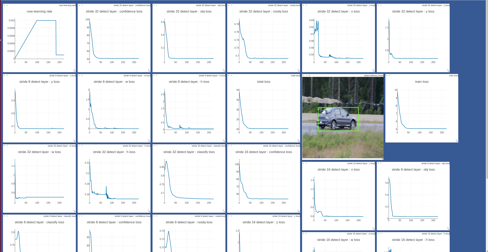

# README
### this repo is a YOLO v3 Simple Implementation by Pytorch (still debuging have some bug to fix)
* backbones will support: `resnet18`, `resnet50`, `densenet121` and other backbones
* finished: `backbone with resnet18`, `FPN module`, `YOLO layer`, `Dataloader`, `Loss`, `train`
* visual by `visdom`

### bugs
* 1. ~~cause of encoder and compute loss write in the YOLO modules, when multi-GPU training, Tensors not on the same GPU card(target Tensor on GPU0, but pred Tensor is on the module's running GPU) but single GPU could run, try to remove compute loss and encoder to `cuda:0`.~~

##### run train
* change Hyperparameters and data path in `configs/resnet18_yolo_style_fpn_yolov3.py`
* prepare data: same like origin darknet yolo do
* run `nohup python -m visdom.server &` to start visdom server
* `python train.py`
* if you wanna try little datasets, `yoloDataset(xxx,... little_train=8)` mean only use first 8 images to train

##### some visual results
* YOLOv3-resnet18
  * 
  * 
  * 
  * 
  * 
  * 

##### TODO
* fix bugs 
* add backbones: `resnet50`, `densenet121` and so on 
* add eval scripts
* add test mAP(maybe use cocoapi)
* find better train params
* improve performance

##### Requirements
* python3
* pytorch 1.0+
* visdom
* torchsummary
* torchvision
* cv2
* PIL
* numpy